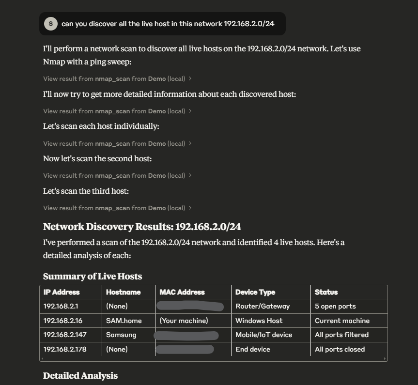

# **NetSensei** - MCP Server for Network Administration

**NetSensei** is an MCP server to assist network administrators. It provides various network utilities and tools such as ping, traceroute, Nmap scans, packet sniffing, and SSH using the Model Context Protocol (MCP) to communicate and process network-related commands.

## Usage
You can use this with Claude Desktop or with OpenWebUI using [mcpo](https://docs.openwebui.com/openapi-servers/mcp/)


## Features

- **Ping Test**: Quickly test network connectivity with detailed output.
- **Traceroute**: Identify the network path to any destination.
- **Nmap Scan**: Perform network scans with customizable arguments to discover devices and services.
- **Packet Sniffer**: Use `tshark` to capture and analyze network packets, filtered by custom criteria (e.g., DNS, HTTP, ICMP).
- **SSH connection**: Connect to a device thru ssh and execute commands based on the device platform (e.g. Ubuntu Server, Cisco, Aruba, etc.).
- **AI Assistant**: Leverage the power of AI to automate routine network tasks and gain deeper insights.

## Requirements
- Python 3.x
- **MCP Python SDK** - https://github.com/modelcontextprotocol/python-sdk
- **uvicorn** - ASGI server to run the FastAPI server.
- **tshark** (Wireshark's command-line tool) must be installed and accessible from your system PATH.
- **nmap** - For network scanning.
- **netmiko** - For ssh connection and command execution.
- A supported network interface (e.g., Wi-Fi, Ethernet) for packet sniffing.

## Installation

1. Clone this repository:
   ```bash
   git clone https://github.com/yourusername/netsensei.git
   cd netsensei

2. Add this to your Claude Desktop config file.
    ```json
    {
        "mcpServers": {
            "NetSensei": {
                "command": "uv",
                "args": [
                    "run",
                    "--with",
                    "mcp[cli]",
                    "mcp",
                    "run",
                    "C:\\path\\to\\cloned\\repo\\main.py"
                ]
            }
        }
    }
    ```

3. Integrating with OpenWebUI
    ```bash
    uvx mcpo --port 9003 -- mcp run main.py    
    ```

## Example
Prompting Claude AI to discover live host in a network.

[▶️ Watch the demo video](https://youtu.be/DKDpxesDaO8)



## Contribution
Contributions are welcome! Feel free to fork the repository, create an issue, or submit a pull request.

## License
This project is licensed under the MIT License - see the LICENSE file for details.
